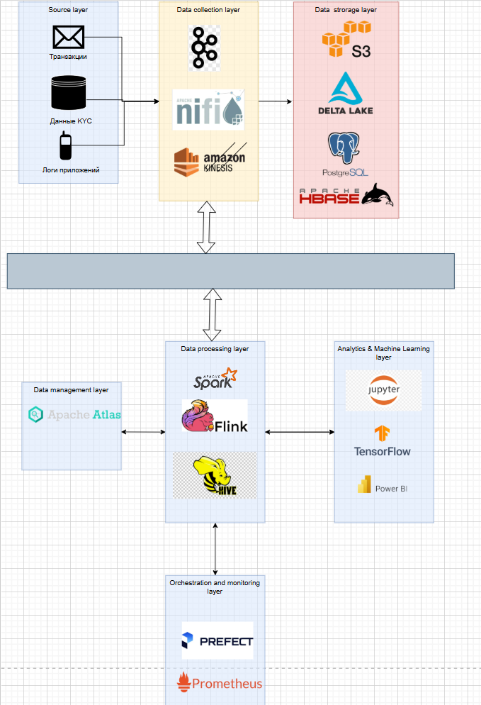

## Финтех-компания: выявление мошенничества, кредитные риски и скоринг клиентов

---

### Шаг 1. Определение требований

#### 1.1 Объем данных

* Ежедневный объём: от 100 до 300 ГБ (высокочастотные транзакции, логи, KYC).
* Годовой объём: до 100 ТБ и выше.
* Ежегодный рост: 30–50%.

#### 1.2 Скорость получения данных

* Транзакции: поток в реальном времени, до 10 000 событий в секунду, критически важно latency < 200 мс.
* Данные KYC: обновления пакетные, 1 раз в сутки / при изменениях.
* Логи приложений: поступают непрерывно, асинхронно, объём до нескольких ГБ в час.

#### 1.3 Типы данных

* Структурированные: данные клиентов (KYC, CRM), банковские справочники, лимиты, параметры счетов.
* Полуструктурированные: транзакционные потоки, JSON-события, API-ответы.
* Неструктурированные: текстовые логи приложений, сообщения об ошибках.

#### 1.4 Требования к обработке

* Фрод-детекция: в реальном времени, задержка < 200 мс от поступления до решения.
* Оценка кредитных рисков: пакетная обработка (batch), ежесуточно / еженедельно.
* Скоринг клиентов: комбинированная схема (online и offline), с регулярным переобучением моделей.
* Отчётность: дашборды по показателям фрода и рисков, ежедневные отчёты для риск-менеджмента.

#### 1.5 Доступность данных

* Время отклика (фрод): <200 мс end-to-end.
* Время отклика аналитических запросов: <10 секунд.
* Доступность системы: 99.95% (допустимый простой <4.5 ч/год).

#### 1.6 Безопасность данных

* Полное шифрование данных (в покое и при передаче).
* Разграничение доступа (роль, регион, уровень сотрудника).
* Аудит действий пользователей.
* Соответствие требованиям 152-ФЗ и PCI DSS.

---

### Шаг 2. Выбор модели хранилища данных

С учётом потоковой аналитики и ML задач выбрана гибридная модель (Hybrid Data Storage), объединяющая:

* Data Lake (сырые и исторические данные для обучения моделей, хранение логов и архивов).
* Data Warehouse / Lakehouse (оптимизированное хранение очищенных данных и скоринговых результатов для аналитики).

---

### Шаг 2.1 Компоненты архитектуры

#### Источники данных

* Поток транзакций (POS, онлайн-банк, мобильное приложение).
* Система KYC/CRM.
* Логи приложений и API (аутентификация, операции, устройства).

---

#### Слой сбора данных (Ingestion Layer)

* Apache Kafka — брокер потоковых данных для транзакций и логов.
* Vector / Logstash — сбор и доставка логов.
* Debezium / Airbyte — CDC-коннекторы для выгрузки KYC из реляционных баз.

---

#### Слой хранения данных (Data Storage Layer)

* Amazon S3 / MinIO (on-prem) — Data Lake для хранения “сырых” и очищенных данных.
* Apache Iceberg / Delta Lake — форматы таблиц с ACID и версионированием для Lakehouse.
* Redis / Aerospike — быстрый Feature Store для онлайн-фрод скоринга.
* ClickHouse — аналитическая СУБД для OLAP-запросов и дашбордов.
* PostgreSQL — хранение метаданных, конфигураций и бизнес-справочников.

---

#### Слой обработки данных (Processing Layer)

* Apache Flink — потоковая обработка (real-time fraud detection, агрегаты по окнам, правила).
* Apache Spark — пакетная обработка и обучение ML моделей.
* Apache Hive — SQL-доступ к данным в Data Lake.

---

#### Слой аналитики и машинного обучения (Analytics & ML Layer)

* TensorFlow / PyTorch — разработка и обучение моделей скоринга и фрод-детекции.
* Jupyter Notebook / Databricks — исследовательская аналитика и тестирование моделей.
* Apache Superset / Grafana — визуализация метрик и дашборды.

---

#### Слой управления данными (Data Governance Layer)

* Apache Atlas / OpenMetadata — каталогизация, lineage и метаданные.
* Apache Ranger — контроль доступа и политика безопасности.

#### Слой оркестрации и мониторинга (Orchestration & Monitoring Layer)

* Apache Airflow — планирование batch-процессов и пайплайнов обучения моделей.
* Prometheus + Grafana — мониторинг состояния сервисов и потоков данных.
* ELK (Elasticsearch, Logstash, Kibana) — централизованное логирование и аудит.

---

### Шаг 3. Схема архитектуры

Логический поток данных (Data Flow):

1. Источники (транзакции, KYC, логи) → Kafka topics.
2. Kafka передаёт события в Apache Flink, где выполняется:

   * обогащение данными KYC из Redis Feature Store;
   * применение правил и вызов модели через gRPC (TensorFlow Serving);
   * формирование решения (`ALLOW / BLOCK / REVIEW`).
3. Результаты фрод-скоринга → ClickHouse / PostgreSQL / Superset dashboards.
4. Параллельно сырые данные пишутся в S3 (Data Lake).
5. Airflow запускает **Spark**-джобы для:

   * обучения моделей (credit scoring, fraud model retrain);
   * периодического анализа рисков;
   * обновления фичей в Feature Store.
6. Аналитики и риск-менеджеры работают в Superset, Grafana, Jupyter.

---

### Шаг 4. Процесс обработки данных

1. Потоковые данные транзакций поступают в Kafka.
2. Apache Flink в реальном времени обрабатывает поток, агрегирует по окнам и вызывает ML-модель для оценки вероятности мошенничества.
3. Результаты (скоринг и статус транзакции) отправляются обратно в Kafka, ClickHouse и систему принятия решений.
4. Все сырые данные и результаты сохраняются в S3 (Data Lake).
5. Ежедневно Airflow запускает Spark для пакетной обработки и анализа кредитных рисков.
6. Модели обучаются в Jupyter/TensorFlow, результаты версионируются (MLflow) и деплоятся в прод через Airflow.
7. Дашборды в Superset/Grafana отображают метрики фрода, рисков и работу пайплайнов.

---

### Шаг 5. Масштабирование и отказоустойчивость

* Kafka — кластер из ≥3 брокеров, репликация данных, балансировка по партициям.
* Flink — кластер с state backend в RocksDB и checkpointing в S3.
* Spark — масштабирование по нодам кластера.
* Redis Cluster — репликация и автоперезапуск.
* S3 / Iceberg — репликация между зонами доступности.
* Airflow и Prometheus — HA режим с несколькими воркерами.
* Kubernetes — автоматическое масштабирование и перезапуск сервисов.

---

### Шаг 6. Безопасность

* Шифрование данных (TLS + KMS).
* Kerberos / IAM для аутентификации.
* Apache Ranger для управления доступом к данным и политикам.
* Резервное копирование S3, PostgreSQL, ClickHouse.
* Маскирование персональных данных KYC.
* Мониторинг доступа и журналирование всех операций (ELK).
* Соответствие 152-ФЗ и PCI DSS.

---

### Шаг 7. Потенциальные проблемы и решения

1. Узкое место — задержка обработки транзакций (<200 мс).

* *Риск:* вызовы модели или медленные lookups могут превысить SLA.
* *Решение:* хранить фичи в Redis (in-memory), минимизировать размер модели, использовать gRPC-интерфейсы и параллельные Flink-потоки.

2. Несогласованность между online/offline feature store.

* *Риск:* разница в вычислениях фичей → рассинхрон скоринга.
* *Решение:* использовать Feast и единую пайплайн-логику для генерации фичей.

3. Рост стоимости хранения и вычислений.

* *Риск:* избыточные данные, дорогие S3-операции.
* *Решение:* внедрить политики retention (90 дней hot, далее cold storage), компрессию Parquet, архивирование в Glacier.

---

### Шаг 8. Резюме

Архитектура обеспечивает:

* Потоковую обработку транзакций с задержкой <200 мс.
* Надёжное хранение и пакетную обработку для кредитного скоринга.
* Единый Feature Store и ML-пайплайны для моделей.
* Высокую отказоустойчивость, безопасность и масштабируемость.
* Полный контроль данных и прозрачный мониторинг.
